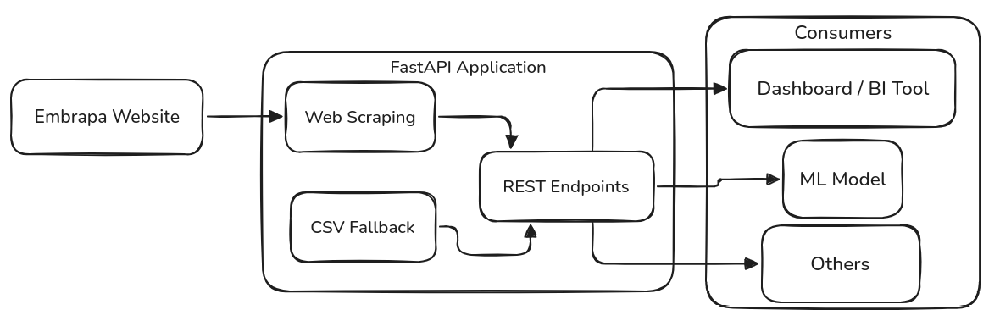

# 🍇 api-embrapa-uvas

API para consulta de dados públicos da vitivinicultura brasileira, com base nas informações disponibilizadas pela Embrapa.

---

## 📌 Objetivo

Este projeto faz parte do Tech Challenge da pós-graduação em Machine Learning Engineering. O objetivo é criar uma API que consulte e disponibilize os dados das seguintes abas do site da Embrapa:

- Produção  
- Processamento  
- Comercialização  
- Importação  
- Exportação  

---

## 🧭 Funcionalidades esperadas

- Consulta automática ao site da Embrapa.
- Fallback local para uso offline ou indisponibilidade do site.
- Endpoints organizados por tipo de dado.
- Documentação acessível para uso da API.

---

## 📊 Diagrama de Arquitetura

Abaixo está uma visão geral de alto nível da arquitetura do projeto:

---

## 📄 Licença

Este projeto está licenciado sob os termos da licença MIT.
